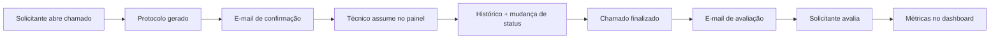

<div align="center">

<h1 align="center">


<br/>

**Sistema de Chamados Técnicos**

</h1>


Plataforma web completa para abertura, acompanhamento e avaliação de chamados técnicos — com área pública responsiva e painel administrativo profissional.

<cite>Sistema corporativo de help desk que conecta solicitantes, técnicos e gestores em um fluxo organizado de atendimento, histórico e métricas de satisfação.</cite>

</div>

---

<h4 align="center"> ✅ Sistema de Chamados Técnicos 🚀 Concluído </h4>

---

## 📝 Descrição

O **Sistema de Chamados Técnicos** é uma aplicação **fullstack monolítica** desenvolvida em Laravel, projetada para empresas que precisam centralizar solicitações de suporte interno.

O solicitante abre chamados pela **área pública** (Tailwind CSS + Flowbite). Técnicos e administradores gerenciam tudo pelo **painel Filament**, com timeline de histórico, atribuição automática de responsável, mudança de status, finalização e avaliação pública do atendimento.

---

## 🏗️ Arquitetura do Projeto

| Item | Classificação |
|------|---------------|
| **Tipo** | 🧱 **Monólito Fullstack** |
| **Backend** | Laravel 13 + PHP-FPM |
| **Frontend público** | Blade + Tailwind CSS 4 + Flowbite + Vite |
| **Painel admin** | FilamentPHP 5 (Livewire) |
| **Banco** | MySQL 8 |
| **Cache / Sessão** | Redis (Docker) · Database (local) |
| **Filas** | Laravel Queue (database driver) |

> Backend, frontend público e painel administrativo coexistem no mesmo projeto Laravel — sem microsserviços e sem API REST separada.

---

## 🔥 Pré-requisitos

| Ferramenta | Versão |
|------------|--------|
| **PHP** | 8.3+ |
| **Composer** | 2.x |
| **Node.js** | 18+ |
| **NPM** | 9+ |
| **MySQL** | 8.0+ |
| **Docker Desktop** | Opcional (ambiente containerizado) |
| **PCOV / Xdebug** | Opcional (cobertura de testes local) |

---

## 🚀 Tecnologias Utilizadas

### Core

| Tecnologia | Versão | Uso |
|------------|--------|-----|
| PHP | 8.3+ | Linguagem principal |
| Laravel | 13.8 | Framework backend |
| FilamentPHP | 5.6 | Painel administrativo |
| MySQL | 8.0 | Banco de dados relacional |
| Redis | 7 | Cache e sessão (Docker) |

### Frontend

| Tecnologia | Versão | Uso |
|------------|--------|-----|
| Tailwind CSS | 4.x | Estilização da área pública |
| Flowbite | 4.x | Componentes UI e alertas |
| Vite | 8.x | Build de assets |
| Blade | — | Templates da área pública |

### Qualidade e DevOps

| Ferramenta | Uso |
|------------|-----|
| PHPUnit | 60 testes automatizados |
| Laravel Pint | Formatação de código |
| Larastan (PHPStan) | Análise estática (level 5) |
| GitHub Actions | CI com Pint + PHPStan + cobertura 90% |
| Docker Compose | Nginx + PHP-FPM + MySQL + Redis + PHPMyAdmin |

### Padrões e arquitetura

- **Service Layer** — regras de negócio isoladas (`ChamadoService`, `HistoricoChamadoService`, etc.)
- **Form Requests** — validação centralizada
- **Policies** — autorização admin vs técnico
- **Enums** — status, complexidade e tipo de usuário
- **Jobs + Mailables** — e-mails assíncronos via fila
- **Factories + Seeders** — dados de demonstração

---

## 🔨 Funcionalidades

### 🌐 Área Pública

- ✅ Abertura de chamado com protocolo único (`CHM-AAAA-NNNNNN`)
- ✅ Consulta de chamado por protocolo
- ✅ Tela de sucesso com dados do solicitante
- ✅ Visualização de chamado finalizado com histórico público
- ✅ Avaliação de atendimento (notas 1–5 + comentário)
- ✅ Alertas responsivos com Flowbite/Tailwind
- ✅ Layout mobile-first com menu hambúrguer

### 🛠️ Painel Administrativo (Filament)

- ✅ Login de administradores e técnicos
- ✅ Dashboard com 12 cards de métricas
- ✅ CRUD de chamados com filtros, busca e badges de status
- ✅ Timeline de histórico na visualização do chamado
- ✅ Assumir chamado, adicionar histórico e finalizar
- ✅ Atribuição automática do técnico responsável
- ✅ CRUD de técnicos e setores (admin)
- ✅ Visualização de avaliações
- ✅ Notificações Filament em ações principais

### ⚙️ Regras de Negócio

- ✅ 9 status de chamado (Em Aberto → Finalizado/Cancelado)
- ✅ 4 níveis de complexidade
- ✅ Permissões por setor (técnico vê só seu setor; admin vê tudo)
- ✅ E-mail de confirmação ao criar chamado
- ✅ E-mail com link de avaliação ao finalizar
- ✅ Impedir avaliação duplicada
- ✅ Token de avaliação com expiração

---

## 🎯 Sobre o Projeto

Sistema desenvolvido demonstrando boas práticas de desenvolvimento, arquitetura limpa e organização de código, com foco em escalabilidade e manutenção.

Todo o sistema está em **português brasileiro** — models, migrations, menus, labels, mensagens e documentação.

---

## 📸 Preview do Projeto

🚧 Preview não disponível no projeto.

---

## 📊 Documentação do Projeto

### 📁 Pasta `docs/`

| Arquivo | Conteúdo |
|---------|----------|
| [COMO_EXECUTAR.md](docs/COMO_EXECUTAR.md) | Índice principal de execução |
| [COMO_EXECUTAR_LOCAL.md](docs/COMO_EXECUTAR_LOCAL.md) | Laragon / `php artisan serve` |
| [COMO_EXECUTAR_DOCKER.md](docs/COMO_EXECUTAR_DOCKER.md) | Docker Compose (porta 8080) |
| [ACESSOS_TESTES.md](docs/ACESSOS_TESTES.md) | Logins demo e fluxos de teste |
| [PERFORMANCE_DOCKER.md](docs/PERFORMANCE_DOCKER.md) | Otimizações de performance Docker |
| [PLANO_IMPLEMENTACAO_CHECKLIST.md](docs/PLANO_IMPLEMENTACAO_CHECKLIST.md) | Checklist de implementação |
| [IMPLANTACAO_EMPRESA.md](docs/IMPLANTACAO_EMPRESA.md) | Guia de implantação corporativa |

### 📬 Postman / Swagger

🚧 O projeto não possui API REST documentada, collections Postman ou Swagger — é uma aplicação web monolítica com rotas Blade.

---

## 💻 Comandos

### 🖥️ Execução Local (Laragon)

```bash
cp .env.example .env
composer install
npm install
php artisan key:generate
php artisan migrate --seed
npm run build
php artisan serve
```

Em outro terminal:

```bash
php artisan queue:work
```

→ http://127.0.0.1:8000

### 🐳 Execução com Docker

```bash
cp .env.example .env
docker compose up -d --build
docker compose logs -f app
```

→ http://localhost:8080 · PHPMyAdmin: http://localhost:8085 · Mailpit: http://localhost:8025

### 🧪 Qualidade de Código

```bash
composer pint          # Laravel Pint
composer stan          # Larastan / PHPStan
composer test          # 60 testes PHPUnit
composer quality       # Pint + PHPStan + testes
```

### ⚡ Desenvolvimento com hot-reload

```bash
composer dev
```

> ⚠️ Estes são comandos básicos. Verifique no projeto arquivos como **README.md**, **docs/COMO_EXECUTAR.md** ou **docs/COMO_EXECUTAR_DOCKER.md** para instruções completas.

---

## 🔑 Acessos Demo

| Perfil | E-mail | Senha |
|--------|--------|-------|
| **Administrador** | admin@admin.com | `password` |
| **Técnico — Desenvolvimento** | lucas-martins@chamados.local | `password` |
| **Técnico — Suporte Técnico/Infra** | marcos-silva@chamados.local | `password` |

| Área | URL Local | URL Docker |
|------|-----------|------------|
| Abrir chamado | `/chamados/novo` | http://localhost:8080/chamados/novo |
| Consultar chamado | `/chamados/consultar` | http://localhost:8080/chamados/consultar |
| Painel admin | `/admin` | http://localhost:8080/admin |

Lista completa de técnicos: [docs/ACESSOS_TESTES.md](docs/ACESSOS_TESTES.md)

---

## 🧱 Estrutura do Projeto

```
sistema-chamados/
├── app/
│   ├── Enums/                  # Status, complexidade, tipo de usuário
│   ├── Models/                 # Setor, Usuario, Chamado, Historico, Avaliacao
│   ├── Services/               # Regras de negócio
│   ├── Http/Controllers/       # Área pública
│   ├── Http/Requests/          # Validações
│   ├── Policies/               # Permissões admin/técnico
│   ├── Mail/ + Jobs/           # E-mails assíncronos
│   └── Filament/               # Resources, Widgets, Pages
├── database/
│   ├── migrations/             # setores, usuarios, chamados, historicos, avaliacoes
│   ├── seeders/                # Setor, Usuario, Chamado
│   └── factories/              # Dados para testes
├── resources/views/
│   └── publico/                # Telas Blade (Tailwind + Flowbite)
├── docker/                     # Nginx, PHP-FPM, scripts de performance
├── docs/                       # Documentação completa
├── tests/                      # 60 testes Feature + Unit
├── docker-compose.yml
└── routes/web.php
```

---

## 🔄 Fluxo do Sistema



1. Solicitante preenche formulário em `/chamados/novo`
2. Chamado entra como **Em Aberto** com protocolo `CHM-2026-000001`
3. E-mail de confirmação é enfileirado
4. Técnico acessa `/admin` e visualiza chamados do seu setor
5. Primeiro histórico **assume automaticamente** o chamado
6. Status é atualizado a cada entrada no histórico
7. Técnico **finaliza** → token de avaliação + e-mail ao solicitante
8. Solicitante avalia em `/chamados/{protocolo}/avaliar/{token}`
9. Admin visualiza métricas e avaliações no dashboard

---

## 📝 Melhorias Futuras

- [ ] Landing page institucional na home
- [ ] SMTP real configurável pelo painel
- [ ] Notificação por e-mail ao técnico quando novo chamado chega no setor
- [ ] Exportação de chamados (CSV/Excel)
- [ ] Recuperação de senha no painel admin
- [ ] Ambiente Docker com SSL (Traefik / Caddy)

---

## 🖋️ Dicas

- Use `composer dev` para subir servidor + fila + logs + Vite de uma vez
- No Docker, após mudar `.env` ou rotas: `docker compose exec app rebuild-cache.sh`
- Para depurar no Docker, temporariamente defina `APP_DEBUG=true` e rode `php artisan optimize:clear`
- Documentação de performance: [docs/PERFORMANCE_DOCKER.md](docs/PERFORMANCE_DOCKER.md)

---

<div align="center">

Feito com ❤️ por Gabriel Martins 🚀

</div>
